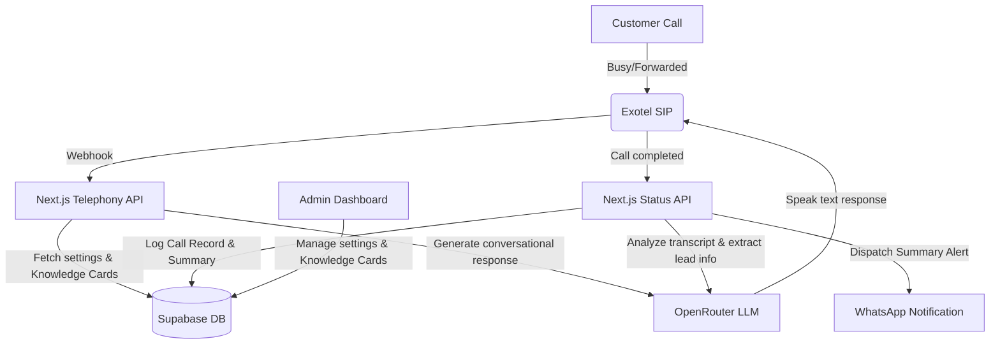

# Jawaab AI — 24/7 AI Voice Receptionist

Jawaab AI is an intelligent voice receptionist system built for Indian small businesses. When business owners are busy, away, or after-hours, Jawaab AI answers customer calls naturally in Hinglish, Hindi, and English. It queries a custom business knowledge base (Knowledge Cards), resolves FAQs, captures customer lead details, and instantly sends structured call summaries directly to the business owner's WhatsApp.

---

## 🏗️ System Architecture



### Flow Breakdown:
1. **Call Forwarding**: Customer calls the business. If busy or reject, the carrier forwards the call to Exotel.
2. **Conversation Loop**: Exotel triggers webhooks to the Next.js API. The API dynamically queries Supabase for the business's active settings and Q&A Knowledge Cards, sends the context to OpenRouter LLM, and streams back the speech response.
3. **Structured Summary & Alerting**: Upon call hangup, the status callback retrieves the raw transcript, parses caller intent and callback requests using LLM extraction, writes the structured lead records to Supabase, and dispatches a WhatsApp summary to the business owner.

---

## 📁 Project Structure (Codebase Skeleton)

```
jawaab-ai/
├── app/                              # Next.js App Router Pages & APIs
│   ├── api/                          # Telephony, Auth, & Business API Handlers
│   │   ├── auth/                     # Session & Cookie management
│   │   └── telephony/                # Exotel webhook processing & status updates
│   ├── dashboard/                    # Admin Dashboard (Overview, Settings, Logs)
│   ├── demo/                         # Watch Demo layout
│   ├── faq/                          # Frequently Asked Questions page
│   ├── login/                        # Dual-panel customized sign in/up page
│   ├── onboarding/                   # Onboarding configuration wizard
│   ├── pricing/                      # Pricing plans layout
│   ├── layout.tsx                    # Global root layout (metadata, fonts, tailwind)
│   ├── not-found.tsx                 # Custom 404 page with swinging panda
│   └── page.tsx                      # Landing/Home page
├── components/                       # Shared React Components
│   ├── landing/                      # Landing page modules (InteractiveDemo, FeatureCards)
│   └── ui/                           # Base UI elements (Navbar, Button, BrandLogo)
├── hooks/                            # Custom React hooks (anime animations)
├── lib/                              # Shared configs (Supabase client init, env validation)
├── public/                           # Static Assets (favicon /icon.png, /logo.png, /panda-404.png)
├── services/                         # External services (OpenRouter LLM chat completions)
├── supabase/                         # Supabase configuration & table SQL
│   └── schema.sql                    # Main DB structure setup script
├── types/                            # Shared TypeScript interfaces
└── tailwind.config.ts                # Tailwind styling configurations
```

---

## 🚀 Key Features

*   **24/7 Voice Receptionist**: Natural conversation flows answering customer queries, handling appointments, and logging lead information.
*   **Hinglish & Multilingual Support**: Seamlessly switch or converse in native Hindi, English, or colloquial Hinglish (code-switching).
*   **Knowledge Cards**: Business owners can configure simple card facts (e.g., pricing, timings, address) to directly guide the voice assistant without LLM hallucinations.
*   **WhatsApp Summaries**: Instant dispatch of customer details (names, purpose of call, callback request, and full transcripts) straight to WhatsApp.
*   **Interactive Call Testing**: Sandbox caller simulator to test voice flow configurations in real-time from the dashboard console.
*   **Splendid UI/UX Layout**: Premium dark-mode user experience, featuring brand milestones, simulated live calls, and custom animations.

---

## 🛠️ Tech Stack

*   **Frontend & Routing**: [Next.js 14](https://nextjs.org/) (App Router), TypeScript, TailwindCSS
*   **Backend & Telephony**: Next.js API Routes, Exotel webhook configurations
*   **Database & Authentication**: [Supabase](https://supabase.com/) (PostgreSQL, Row Level Security, Client Auth APIs)
*   **Animations**: [Anime.js](https://animejs.com/) for fluid visual transitions and mock wave simulations
*   **AI Engine**: [OpenRouter](https://openrouter.ai/) (configured by default to leverage low-latency models like `meta-llama/llama-3.1-8b-instruct` or `google/gemini-flash-1.5`)

---

## ⚙️ Project Setup & Installation

### 1. Clone the repository and install dependencies

```bash
npm install
```

### 2. Configure Environment Variables

Create a `.env` or `.env.local` file at the root of your project:

```env
# Supabase Configuration
NEXT_PUBLIC_SUPABASE_URL=your-supabase-url
NEXT_PUBLIC_SUPABASE_ANON_KEY=your-supabase-anon-key
SUPABASE_SERVICE_ROLE_KEY=your-supabase-service-role-key

# OpenRouter API Configuration
OPENROUTER_API_KEY=your-openrouter-api-key

# Telephony Configuration (Optional for mock testing)
EXOTEL_API_KEY=your-exotel-key
EXOTEL_API_TOKEN=your-exotel-token
EXOTEL_ACCOUNT_SID=your-exotel-sid
```

### 3. Setup Database Schema (Supabase)

Make sure you configure the Supabase PostgreSQL database tables using the schema located in [schema.sql](file:///c:/Users/harsh%20uppal/Desktop/jawaab%20AI/supabase/schema.sql):
*   `businesses` — Stores registration info and owner details.
*   `business_settings` — Handles operating hours, fallback numbers, and provider choices.
*   `knowledge_cards` — Q&A facts dynamically injected into context prompts.
*   `calls` — Logs telephony IDs, caller numbers, duration, and timestamps.
*   `call_summaries` — Call intelligence summaries and JSON conversation transcripts.
*   `prompt_configurations` — System level prompts and safety configurations.
*   `onboarding_preferences` — Step-by-step preferences chosen during onboarding.

### 4. Run Development Server

```bash
npm run dev
```

Open [http://localhost:3000](http://localhost:3000) in your browser to view the application.

---

## 🎨 Branding & Customizations

*   **Primary Logos**: The brand uses `/logo-navbar.png` as its transparent logo, styled with CSS filters to blend correctly into dark-themed navbars.
*   **Mascot / 404**: Rendered as a cute swinging panda on bamboo in `app/not-found.tsx`.
*   **Tab favicon**: Configured globally using the `/icon.png` asset.
