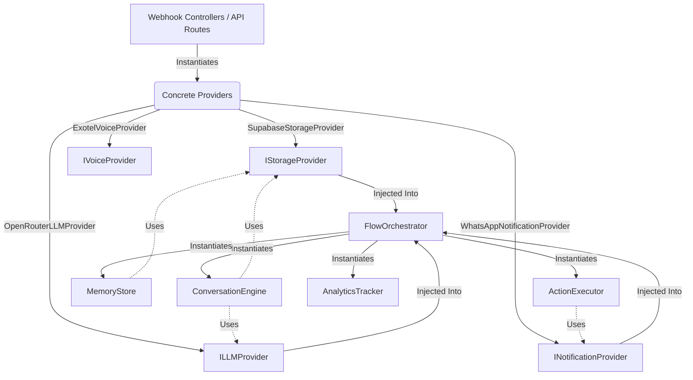

# Dependency Injection Graph

This graph outlines the service layers and concrete providers injected into the core conversational engine of Jawaab AI.

---

## 🔌 Decoupled Integration Pattern

Every module is built to depend on abstract interfaces instead of specific database clients, network addresses, or API keys:

1.  **Orchestrator Boundaries**: `FlowOrchestrator` receives interfaces `IStorageProvider`, `ILLMProvider`, and `INotificationProvider` inside its constructor.
2.  **No Global Scope Pollution**: Services never create client wrappers internally, preventing testing locks and making it simple to swap providers (e.g., swapping Exotel for other carriers, or OpenRouter for a direct Anthropic SDK integration).
