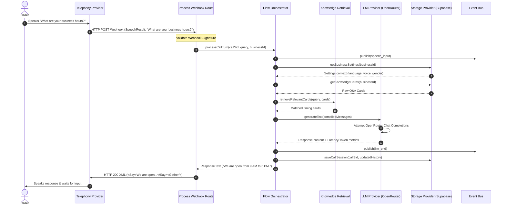
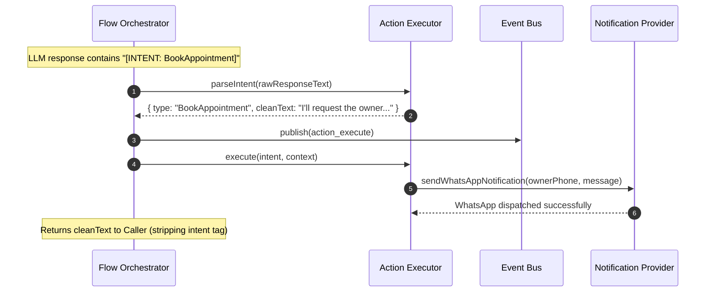

# Sequence Diagrams — Call Lifecycle Hooks

These sequence diagrams outline the message passings between the telephony provider, our backend routes, the event orchestrator, and external API providers.

## 1. Active Conversation Turn Loop

## 2. Intent Action Execution Flow

