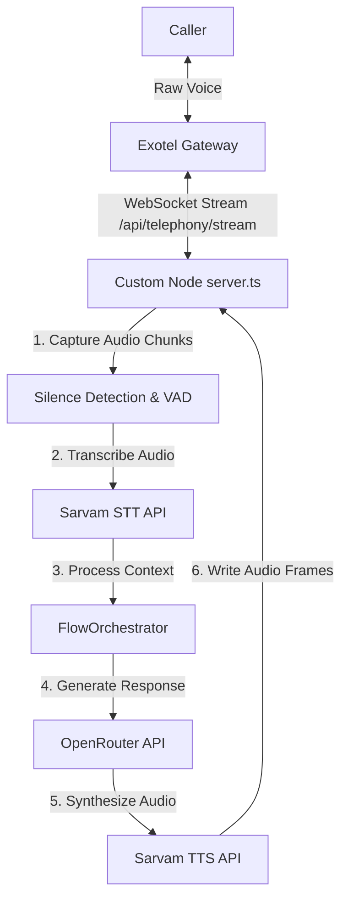

# Jawaab AI — Day 1 Engineering Summary

This document summarizes the architectural upgrades, modular implementations, and local testing configurations achieved on **Day 1** of Phase 2 development.

---

## 🏗️ 1. Core Architecture Transition
We successfully shifted Jawaab AI from an **HTTP turn-based webhook loop** to a **Real-Time WebSocket Audio Streaming Backend** using Exotel's AgentStream protocol.

### Real-Time Flow Design

---

## 🧩 2. Decoupled Backend Service Layer
All core conversational, memory, and database actions were moved to the new [backend/](file:///c:/Users/harsh%20uppal/Desktop/jawaab%20AI/backend/) directory:

1.  **Strict Interfaces** ([providers/index.ts](file:///c:/Users/harsh%20uppal/Desktop/jawaab%20AI/backend/providers/index.ts)): Contracts for voice formats, LLMs, storage, and notifications.
2.  **Exotel Voice Provider** ([providers/exotel.ts](file:///c:/Users/harsh%20uppal/Desktop/jawaab%20AI/backend/providers/exotel.ts)): Compiles voice response XML markup.
3.  **Supabase Storage Provider** ([providers/supabase-storage.ts](file:///c:/Users/harsh%20uppal/Desktop/jawaab%20AI/backend/providers/supabase-storage.ts)): Handles business profiles, settings, and cards.
4.  **OpenRouter LLM Provider** ([providers/openrouter.ts](file:///c:/Users/harsh%20uppal/Desktop/jawaab%20AI/backend/providers/openrouter.ts)): Runs Llama-3.1-8b completions with latency tracking.
5.  **Conversation Engine** ([conversation/engine.ts](file:///c:/Users/harsh%20uppal/Desktop/jawaab%20AI/backend/conversation/engine.ts)): Prunes transcripts and manages prompt contexts.
6.  **Prompt Builder** ([prompt/builder.ts](file:///c:/Users/harsh%20uppal/Desktop/jawaab%20AI/backend/prompt/builder.ts)): Handles multilingual tone parameters.
7.  **Memory Store** ([memory/store.ts](file:///c:/Users/harsh%20uppal/Desktop/jawaab%20AI/backend/memory/store.ts)): Persists conversation threads in `call_summaries`.
8.  **Action Executor** ([actions/executor.ts](file:///c:/Users/harsh%20uppal/Desktop/jawaab%20AI/backend/actions/executor.ts)): Handles parsed LLM triggers (like booking human callbacks).
9.  **Event Bus** ([services/event-bus.ts](file:///c:/Users/harsh%20uppal/Desktop/jawaab%20AI/services/event-bus.ts)): Dispatches metrics, token counts, and alerts.

---

## ⚡ 3. WebSocket Server Gateway (`server.ts`)
We built a custom Next.js-integrated HTTP/WebSocket server [server.ts](file:///c:/Users/harsh%20uppal/Desktop/jawaab%20AI/server.ts) that features:

*   **Dynamic Business Resolution**: Telephony gateways strip query parameters on WebSocket handshakes. The server resolves the `business_id` dynamically by querying the database using the unique `callSid` during the stream's `start` event.
*   **Root-Mean-Square (RMS) VAD**: Measures raw PCM voice amplitudes in real time to detect speech. Once silence is detected for `1.2` seconds, it triggers the STT/LLM response generation.
*   **Barge-in Protection**: Interrupts the bot's speech playback immediately if the caller starts speaking over the bot, clearing buffered audio and resuming listening mode.
*   **Frame Slicing**: Converts synthesized WAV files to raw 16-bit PCM and streams them back to Exotel in 20ms chunks (640 bytes for 16kHz audio) to maintain jitter buffer stability.

---

## 🛠️ 4. Development & Verification Fixes
*   **Friendly GET Endpoints**: Added GET handlers to `/api/telephony/incoming` and `/api/telephony/status` to prevent browser `405 Method Not Allowed` errors.
*   **Developer Bypass**: Configured signature check bypasses when `EXOTEL_WEBHOOK_SECRET=bypass` is set in development.
*   **Sarvam TTS Voice Fix**: Updated the synthesizer voice to `anushka` and `abhilash` (resolving the TTS 400 error caused by the obsolete `meera` speaker parameter).
*   **Build Status**: The Next.js production compiler built cleanly with **0 compilation errors**.
